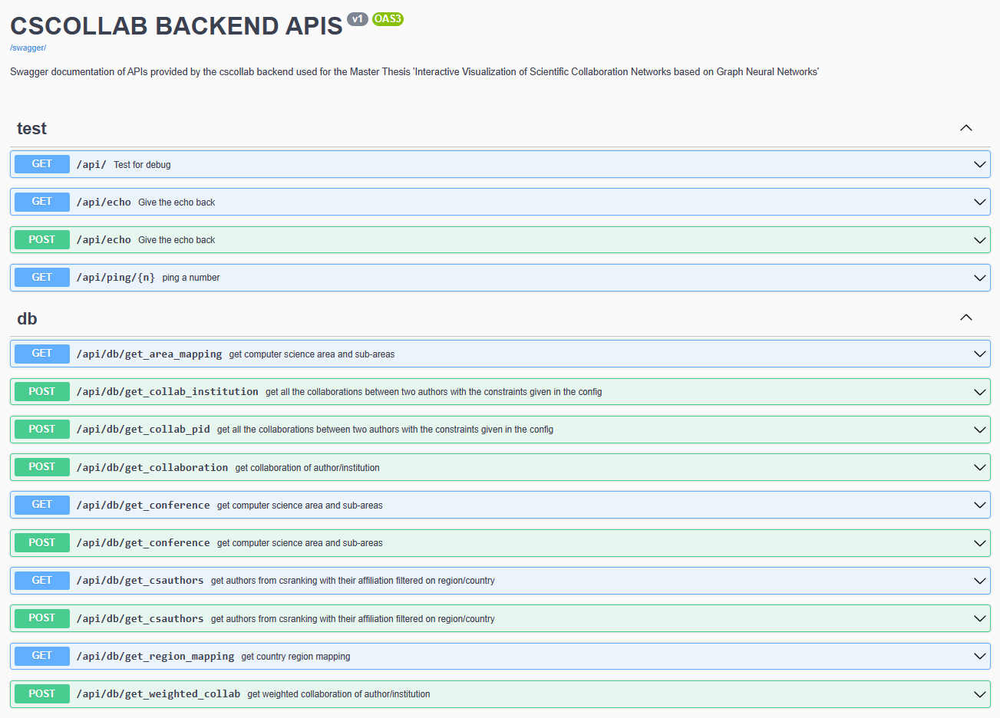

# Backend Server 

The backend is created with [flask](https://flask.palletsprojects.com/en/2.2.x/) and the file *server.py* starts the flask server 
and in the file *app.py* the backend is defined. Under the *views/* directory all the endpoints area defined. To create a documentation of the APIs
the library swagger-ui-bundle is used.

## Virtual Environment 

Use *backend/* as the working directory and always activate the virutal environment of this directory

```{shell}
virtualenv venv
source venv/bin/activate
pip install -r requirements.txt
```

## Start the Server

The server will run at http://127.0.0.1:8030 and the swagger API documentation can be found at /swagger-ui

```{shell}
source venv/bin/activate
make server
```

## Overview APIs



## Graph Analysis

Under the directory */analytics* are the core functions to calculate statistics and graph theoretical analytics from given nodes and edges. 
The analytics are calculated with the networkx library and are published under the */api/analytics/* endpoints. 

For example the API */api/analytics/get_analytics_collab* takes as an input the config used for get_weighted_collab() and a paramerter "top" which is the number
of top nodes to show from the centrality scores and returns a summary of graph theoretical analytics and statistics. For example the input {'config': '{"from_year": 2010, "area_id": "ai", "area_type": "a", "region_id": "dach", "strict_boundary": true, "institution": false}', 'top': 3} results in the following output:

```{shell}
{
    "statistics":{
      "average_degree":3.0386100386100385,
      "average_shortest_path":4.016052235357255,
      "clustering_coefficient":0.19633113436355548,
      "degree_assortativity_coefficient":0.2742268589945848,
      "density":0.00587738885611226,
      "edges":787,
      "is_connected":false,
      "largest_connected_component":370,
      "loops":0,
      "max_degree":23,
      "nodes":518,
      "number_connected_components":57,
      "triangle_count":310
   },
   "centralities":{
      "betweenness_centrality":{
         "85/6201":0.08489004596944434,
         "97/119":0.10023496254305903,
         "s/BerntSchiele":0.08641003108874803
      },
      "closeness_centrality":{
         "97/119":0.20290254609829733,
         "r/CarstenRother":0.20337259060663318,
         "s/BerntSchiele":0.20656274889065881
      },
      "degree_centrality":{
         "97/119":0.04448742746615087,
         "r/CarstenRother":0.04448742746615087,
         "s/BerntSchiele":0.04061895551257253
      },
      "eigenvector_centrality":{
         "13/6920":0.19581685014562877,
         "24/8616":0.6656576120254529,
         "61/5017":0.7038679180984857
      }
   }
}
```
