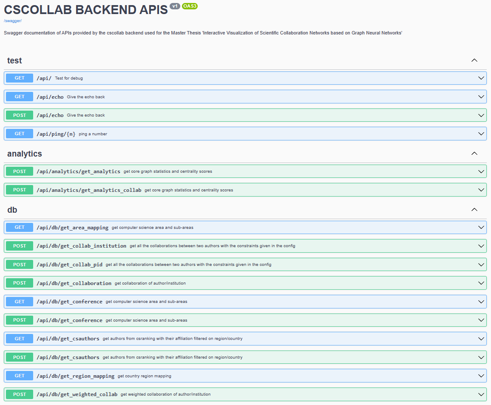

# Backend Server 

The backend is created with [flask](https://flask.palletsprojects.com/en/2.2.x/) and the file *server.py* starts the flask server 
and in the file *app.py* the backend is defined. Under the *views/* directory all the endpoints area defined. To create a documentation of the APIs
the library swagger-ui-bundle is used.

## Virtual Environment 

Use *backend/* as the working directory and always activate the virutal environment of this directory

```{shell}
virtualenv venv
source venv/bin/activate
pip install -r requirements.txt
```

## Start the Server

The server will run at http://127.0.0.1:8030 and the swagger API documentation can be found at /swagger-ui

```{shell}
source venv/bin/activate
make server
```

## Overview APIs


