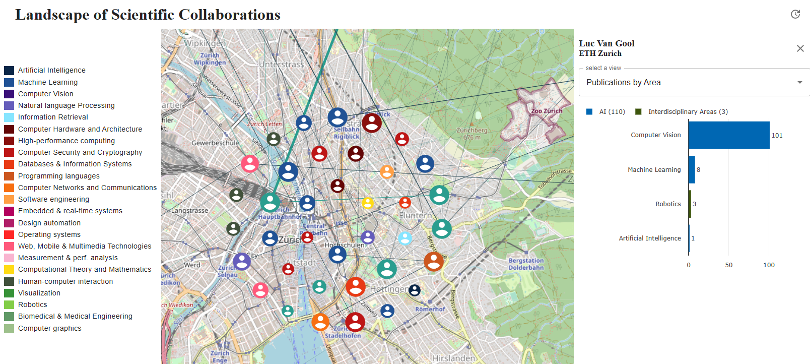
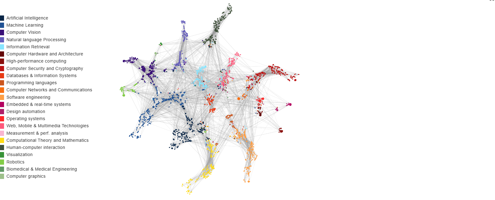
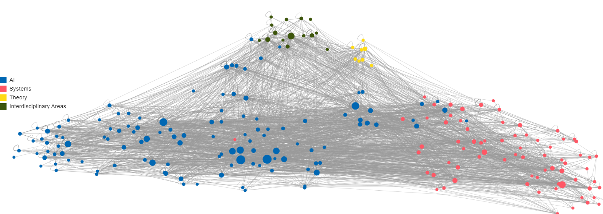
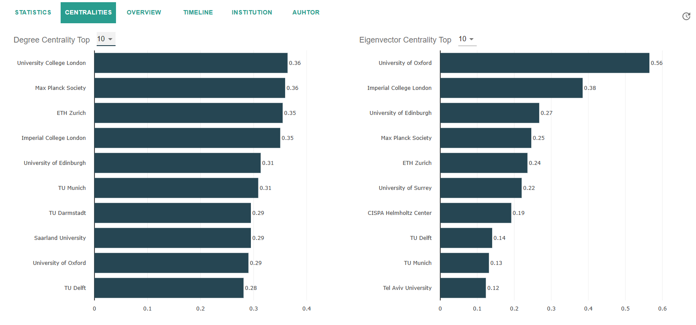
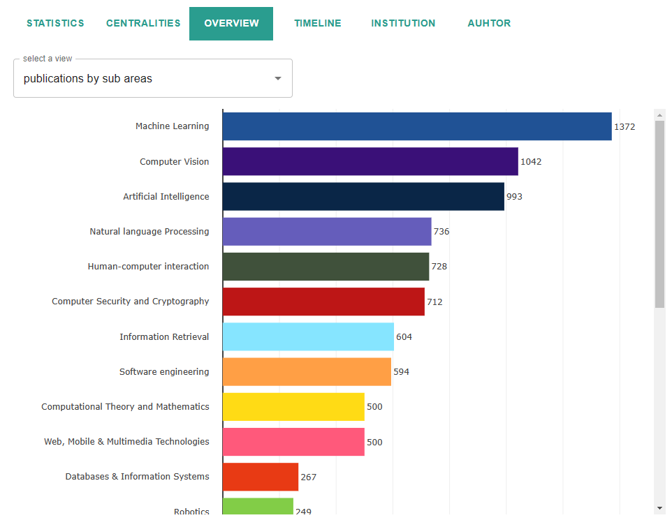
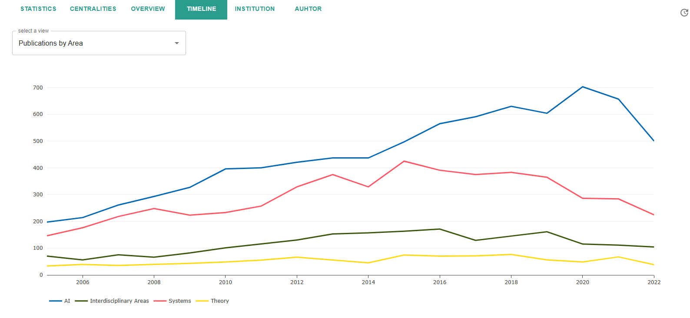
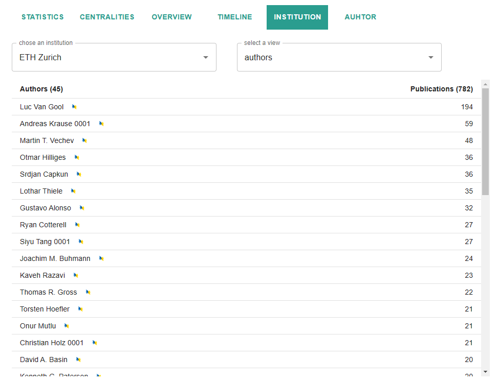

# Frontend

## Tooling

### Prerequisites
For the development of the frontend [clojure](https://clojure.org/guides/getting_started) (requires Java and the Maven project manager) is used in combination with [Node.js](https://nodejs.org/en/) an the NPM package manager.

The required software could be installed with the following commands:

```bash
apt update
apt install default-jre #install java
apt install maven 
brew install clojure/tools/clojure #install clojure
apt install nodejs 
apt install npm 
```

### Packages

The application is built with the [ClojureScript](https://clojurescript.org/index) framework [re-frame](https://day8.github.io/re-frame/re-frame/), which leverages [React](https://reactjs.org/) and [Reagent](https://reagent-project.github.io/). For the UI design and components google's material UI library [mui](https://mui.com/) is used. The required cljs packages are defined under *deps.edn and* the packages are downloaded automatically when the project is compiled with [shadow-cljs](https://shadow-cljs.github.io/docs/UsersGuide.html). The javascipt packages are defined under *package-lock.json* and can be installed with "npm i --save" 

## Start Frontend

The release version of the frontend can be started by simply creating a python http server in the output direcotry:

```bash
python3 -m http.server 8090
```

## File Ovierview
```
├── src/app
│   ├── common
│   |   ├── container.cljs  # graphical container
│   |   ├── plotly.cljs     # chart component
│   |   ├── user_input.cljs # general input panel 
│   ├── components
│   |   ├── app_bar.cljs    # application navigation bar
│   |   ├── color.cljs      # color palletes to use for the app
│   |   ├── alert.cljs      # material ui alert 
│   |   ├── button.cljs     # material ui buttons 
│   |   ├── drawer.cljs     # drawer/menu component
│   |   ├── feedback.cljs   # material ui feedback 
│   |   ├── grid.cljs       # material ui grid
│   |   ├── inputs.cljs     # input components
│   |   ├── layout.cljs     # app layout components
│   |   ├── lists.cljs      # list components
│   |   ├── loading.cljs    # loading component
│   |   ├── table.cljs      # material ui table
│   |   ├── tabs.cljs       # material ui tabs
│   ├── cscollab
│   |   ├── panels  
│   |   |   ├── filter_panel.cljs   # graph filters 
│   |   |   ├── map_panel.cljs      # graph configuration and interactions 
│   |   ├── view  
│   |   |   ├── selected_info.cljs  # overview of selected graph element 
│   |   |   ├── conference
│   |   |   |   ├──  conference.cljs    # conference list
│   |   |   ├── graph
│   |   |   |   ├──  graph_view.cljs    # network visualization
│   |   |   |   ├──  graph.cljs         # graph visualization component
│   |   |   ├── map
│   |   |   |   ├──  interactive_map.cljs   # geographical visualization
│   |   |   |   ├──  leaflet.cljs           # interactive map component
│   |   ├── data.cljs     # data manipulation 
│   |   ├── common.cljs     # common events or subscriptions
│   |   ├── transformer.cljs     # data transformations
│   |   ├── api.cljs     # api calls and subscriptions
│   |   ├── nav.cljs      # app navigation
│   |   ├── views.cljs    # all app views
│   ├── core.cljs         # init application and events
│   ├── db.cljs           # define application database and its events
│   ├── router.cljs       # define router and its events
│   ├── util.cljs         # general utility functions
│   ├── app.cljs        # define the main app view and routes
├── public
│   ├── css
│   ├── data              # static data files
│   ├── js                # generated compiled js files
│   ├── index.html
├── output                # directory of the project release
├── deps.edn              # cljs package requirements
├── shadow-cljs.edn       # shadow-cljs project configuration 
├── node_modules          # js packages
├── package.json          # js package requirement
└── .gitignore
```

## Visualization Page 

### Filters, Configuration and Interactions

On top of the page there is a panel where one can filter, configer and interact with the collaboration network.


The graph filter panel allows to filter the collaboration network based on:
* the publication year (2005-2022)
* research area/sub area of the publication
* region/country of the authors or affiliated institutions
* An option to set a strict country/region restriction where only collaborations within the selected regions are considered

In the graph configuaration and interaction panel the following options are available:

* chose if one is interested in the author collaboration or the collaboration between institutions
* one can select a node and click "show" which will highlight the node and zoom to the node position in the current visualization
* one can choose to color the nodes in the current graph visualization where one has the following options: no coloring, color by top area, color by top sub area, color by degree centrality or color by eigenvector centrality


### Views

#### Map


Geographical visualisation of the selected collaboration network in form of an interactive map implemented with leaflet.js
One can zoom and pan the map and fully explore the network (also full screen option available). If you click on an edge or node (institution or author icon depending on the chosen network) all nodes or edges connected to that node/edge will be highlighted in green and an information box on the right will open which shows information of the node and multiple tabs with different visualizations of network data of that node/edge.



Available visulaizations of nodes are:

* publication plot: show in how many publications of each research area that node collaborated in
* auhtor list (only if the node is an institution): a list of all authors affiliated with that institution ranked by their publication count
* institution plot: shows with which institutions that node had collaborated and how my publications per institution
* country plot: shows with which countries that node had collaborated and how my publications per countries
* year plot: shows in how many publicaitons that node collaborated in each year
* author collaboration plot: shows with which authors that node had collaborated and how my publications per authors

#### Graph

The collaboration network is visualized as a graph and implemented with cytoscape.js. The interactions are the same as with the map component. The graph can be viewed in full screen and one can zoom and pan the graph and click on edges/nodes and get exactly the same information box and charts on the right as in the geographical mal. 
 
The determin the position of the nodes a graph convolutional network model (GCN) was used that was trained based on a node classification task. The task was to classify nodes (institutions or authors) by the research area or sub area where they had to most publicaitons in. This results in 4 models: 2 for the author collaboration network where one predicts nodes on the top research area and the other on the top sub area and 2 models for the institutional network where one predicts nodes on the top research area and the other on the top sub area. The position of the nodes can be determined by using the last hidden convolutional output layer and apply a dimensionality reduction algorithm on it project the results on a 2 dimensioanl space. This allows us the position the nodes based on the results of the GCN model and have the nodes grouped by their top research area/sub area.






#### Analytics

Here there are several views availbe to get analytics, statistics and visualitations of the data of the selected collaboration network.

##### Statistics

Here following statistics of the selected coollaboration network are shown:


##### Centralities

The top degree and eigenvector centralities of the selected network is shown



##### Overview

Here one can select a view each view is shown as a horizonal bar chart. For the following views an additonal selection can be made were one can filter the data based on the research area/sub area:

* number of publications by institutions
* number of publications by authors
* number of publications by countries
* number of authors by institutions
* number of authors by countries


and two views were no research area can be selected:
* number of publications by area
* number of publications by sub area



##### Timeline

Here the temporal dimension of the publications present in the network is shown in 3 view:

* total publications over time
* publications by area over time
* publications by sub area over time



##### Institution

Here an institution can be selected and a view, where the views are exatly the same as the views in the infobox if and institutional node is selected in the map/graph:

* publication plot: show in how many publications of each research area that node collaborated in
* auhtor list: a list of all authors affiliated with that institution ranked by their publication count
* institution plot: shows with which institutions that node had collaborated and how my publications per institution
* country plot: shows with which countries that node had collaborated and how my publications per countries
* year plot: shows in how many publicaitons that node collaborated in each year
* author collaboration plot: shows with which authors that node had collaborated and how my publications per authors



##### Author

Here an author can be selected and a view, where the views are exatly the same as the views in the infobox if and author node is selected in the map/graph:

* publication plot: show in how many publications of each research area that node collaborated in
* institution plot: shows with which institutions that node had collaborated and how my publications per institution
* country plot: shows with which countries that node had collaborated and how my publications per countries
* year plot: shows in how many publicaitons that node collaborated in each year
* author collaboration plot: shows with which authors that node had collaborated and how my publications per authors


